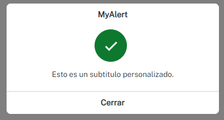
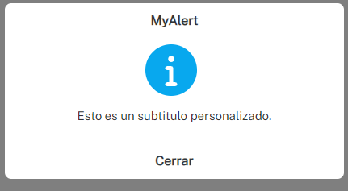
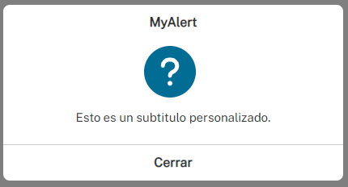
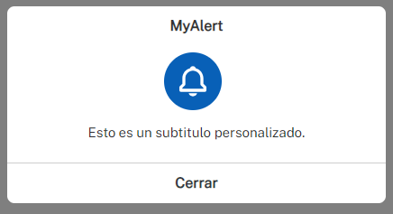
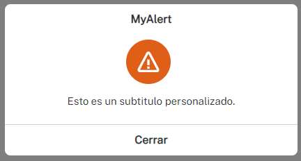
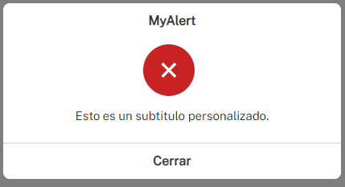

# MyAlert

📍MyAlert es una biblioteca desarrollada en JavaScript que te permite crear alertas personalizadas de forma sencilla con solo hacer una instancia de la clase.

## Demostración

Aquí tienes una vista previa de cómo se verían las diferentes alertas personalizadas utilizando MyAlert:

  
  

## Instalación

Para comenzar a utilizar MyAlert en tu proyecto, sigue estos pasos:

1. Copia los archivos [myalert.js](myalert.js) y [myalert.js](myalert.css) en la carpeta de tu proyecto.
2. Importa los archivos en tu HTML:

```html
<!-- CSS -->
<link rel="stylesheet" href="myalert.css">
<!-- JS -->
<script src="myalert.js"></script>
```
## USO 

Para crear y personalizar tu alerta, utiliza el siguiente código en un script JavaScript:

```js
const myalert = new MyAlert();

myalert.launch({    
    title: "MyAlert",
    icon: 'success',
    iconcolor: 'color',
    subtitle: 'Esto es un subtitulo personalizado.',
    msgs: ['mensaje 1', 'mensaje 2', 'mensaje 3'],
});

```

### Variables predefinidas

* **title:** Corresponde al título de la alerta.
* **icon:** Corresponde al ícono de la alerta.
* **iconcolor:** Corresponde al color que tomarán los íconos de la alerta.
* **subtitle:** Corresponde al subtítulo de la alerta.
* **msgs:** Corresponde a los mensajes que mostrará la alerta.

> [!TIP]
> Para personalizar los íconos puede pasarle iconos svg como iconos de cualquier librería de íconos. En el último caso deberá tener la librería previamente importada en su HTML

## Pautas de constribución

¡Se permiten las contribuciones al proyecto! Si tienes sugerencias de mejoras, nuevas características o encuentras algún problema, no dudes en abrir un issue o enviar un pull request.


